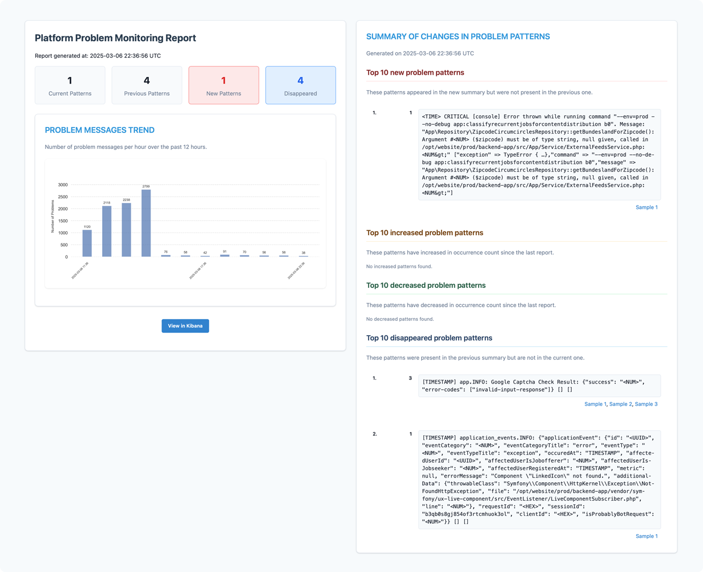

# Platform Problem Monitoring — Core Application

[](https://github.com/dx-tooling/platform-problem-monitoring-core/actions/workflows/tests.yml)
[](https://github.com/dx-tooling/platform-problem-monitoring-core/actions/workflows/code-quality.yml)

A proactive monitoring solution that automatically analyzes your Elasticsearch logs, detects patterns, and delivers concise email reports about your platform's health.

If you already have an ELK stack setup up and running, Platform Problem Monitoring delivers *this* ↓ into your mailbox every hour:

<p align="center">
  
</p>

## What This Tool Does

Platform Problem Monitoring Core helps platform engineers and system administrators by:

- **Detecting problems automatically** — Identifies errors, exceptions, and warnings in your logs without manual searching
- **Recognizing patterns** — Normalizes similar log messages to reveal systemic issues
- **Tracking changes over time** — Compares current issues with previous runs to show what's new, increasing, or decreasing
- **Delivering digestible reports** — Sends clear, well-formatted email reports with Kibana links to examples

## Is This Tool Right For You?

This tool is ideal if:

- You already have an ELK (Elasticsearch, Logstash, Kibana) stack collecting logs
- You want automated, periodic health assessments of your platform
- You prefer receiving digestible summaries rather than real-time alerts
- You need to understand patterns and trends in your platform's problems

## Prerequisites

- **Python 3.10+** installed on the host system
- **Network access** to:
  - Your Elasticsearch server
  - An AWS S3 bucket (for state storage between runs)
  - An SMTP server (for sending reports)
- **Credentials** for all these services

## Quick Start

1. **Clone the repository:**
   ```bash
   git clone <repository-url>
   cd platform-problem-monitoring-core
   ```

2. **Set up a virtual environment:**
   ```bash
   python3 -m venv venv
   source venv/bin/activate  # On Windows: venv\Scripts\activate
   ```

3. **Install the package:**
   ```bash
   pip3 install -e .
   ```

4. **Create a configuration file:**
   ```bash
   cp src/platform_problem_monitoring_core.conf.dist platform_problem_monitoring_core.conf
   ```

5. **Edit the configuration:**
   ```
   REMOTE_STATE_S3_BUCKET_NAME="your-s3-bucket"
   REMOTE_STATE_S3_FOLDER_NAME="platform-monitoring"

   ELASTICSEARCH_SERVER_BASE_URL="https://your-elasticsearch-server:9200"
   ELASTICSEARCH_LUCENE_QUERY_FILE_PATH="path/to/lucene_query.json"

   KIBANA_DISCOVER_BASE_URL="https://your-kibana-server:5601"
   KIBANA_DOCUMENT_DEEPLINK_URL_STRUCTURE="https://your-kibana-server:5601/app/discover#/doc/logstash-*/{{index}}?id={{id}}"

   SMTP_SERVER_HOSTNAME="smtp.example.com"
   SMTP_SERVER_PORT="587"
   SMTP_SERVER_USERNAME="your-smtp-username"
   SMTP_SERVER_PASSWORD="your-smtp-password"
   SMTP_SENDER_ADDRESS="monitoring@example.com"
   SMTP_RECEIVER_ADDRESS="alerts@example.com"
   ```

6. **Set up the Elasticsearch query:**
   ```bash
   cp src/lucene_query.json.dist lucene_query.json
   ```

   This default query looks for error messages while filtering out noise:
   ```json
   {
       "query": {
           "bool": {
               "should": [
                   { "match": { "message": "error" } },
                   { "match": { "message": "failure" } },
                   { "match": { "message": "critical" } },
                   { "match": { "message": "alert" } },
                   { "match": { "message": "exception" } }
               ],
               "must_not": [
                   { "match": { "message": "User Deprecated" } },
                   { "match": { "message": "logstash" } },
                   { "term": { "syslog_program": "dd.collector" } }
               ],
               "minimum_should_match": 1
           }
       }
   }
   ```

7. **Run the tool:**
   ```bash
   ./src/run.sh ./platform_problem_monitoring_core.conf
   ```

## How It Works

When executed, the tool:

1. **Prepares the environment** by creating a temporary work directory
2. **Downloads previous state** from S3 (for comparison)
3. **Queries Elasticsearch** for new problem-related log messages since the last run
4. **Extracts relevant fields** from the returned documents
5. **Normalizes messages** by replacing dynamic parts like UUIDs, timestamps, and specific values with placeholders
6. **Compares current patterns** with the previous run to identify new, increased, and decreased issues
7. **Generates an email report** with detailed information about all identified issues
8. **Sends the report** via your configured SMTP server
9. **Stores the current state** in S3 for the next run
10. **Cleans up** temporary files

## Common Configuration Scenarios

### Example: Monitoring a Kubernetes Cluster

For a Kubernetes deployment, you might want to focus on pod-related errors:

```json
{
    "query": {
        "bool": {
            "should": [
                { "match": { "kubernetes.pod.name": "*" } },
                { "match_phrase": { "message": "error" } },
                { "match_phrase": { "message": "exception" } }
            ],
            "must_not": [
                { "match": { "message": "liveness probe failed" } }
            ],
            "minimum_should_match": 2
        }
    }
}
```

### Example: Monitoring Web Services

For web services, you might focus on HTTP errors and performance issues:

```json
{
    "query": {
        "bool": {
            "should": [
                { "range": { "http.response.status_code": { "gte": 500 } } },
                { "range": { "response_time_ms": { "gte": 1000 } } },
                { "match_phrase": { "message": "timed out" } }
            ],
            "minimum_should_match": 1
        }
    }
}
```

## Scheduled Monitoring

To run the tool periodically, set up a cron job:

```bash
# Run every 6 hours
0 */6 * * * cd /path/to/platform-problem-monitoring-core && ./src/run.sh ./platform_problem_monitoring_core.conf >> /var/log/platform-monitoring.log 2>&1
```

## Advanced Configuration

### Configuring AWS Credentials

The tool uses boto3's default credential resolution. You can:

1. Set environment variables: `AWS_ACCESS_KEY_ID` and `AWS_SECRET_ACCESS_KEY`
2. Use a shared credentials file (`~/.aws/credentials`)
3. Use IAM roles if running on EC2 instances

## Troubleshooting

### No Reports Being Sent

1. Check Elasticsearch connectivity: `curl -X GET https://your-elasticsearch-server:9200/_cat/indices`
2. Verify S3 bucket permissions
3. Test SMTP settings: `python -m smtplib -d smtp.example.com:587`
4. Check your query matches actual log patterns

### Reports Missing Expected Issues

1. Test your Elasticsearch query directly in Kibana
2. Check the date range - are you missing events due to time zone issues?
3. Adjust the Lucene query to be more inclusive

### Performance Issues

For large log volumes:

1. Increase the time between runs to process more logs at once
2. Optimize your Elasticsearch query with more specific filters
3. Ensure the host running the tool has sufficient memory

## Getting Help

If you encounter problems or have questions, please:

1. Check the detailed logs in your temporary work directory
2. Open an issue in our repository with your configuration (with sensitive data removed)
3. Include error messages and steps to reproduce the issue

## Development

### Development Setup

1. **Clone the repository:**
   ```bash
   git clone <repository-url>
   cd platform-problem-monitoring-core
   ```

2. **Install development dependencies:**
   ```bash
   make install
   ```
   This creates a virtual environment, installs the package and all development dependencies, and sets up pre-commit hooks.

3. **Activate the virtual environment:**
   ```bash
   source venv/bin/activate  # On Windows: venv\Scripts\activate
   ```

### Code Quality Tools

This project uses a unified approach to code quality with all tools configured in `pyproject.toml` and executed via:

1. **Pre-commit hooks** - Run automatically before each commit
2. **Make commands** - Run manually or in CI

Available make commands:

```bash
make format        # Format code with black and isort
make format-check  # Check formatting without changing files
make lint          # Run ruff linter
make lint-fix      # Run ruff linter with auto-fix
make type-check    # Run mypy type checking
make security-check # Run bandit security checks
make quality       # Run all checks with formatting
make ci-quality    # Run all checks without formatting (used in CI)
```

The pre-commit hooks are configured to use the same Makefile targets, ensuring consistency between local development and CI environments.

## License

This project is available under the MIT License — Copyright (c) 2025 Manuel Kießling.
